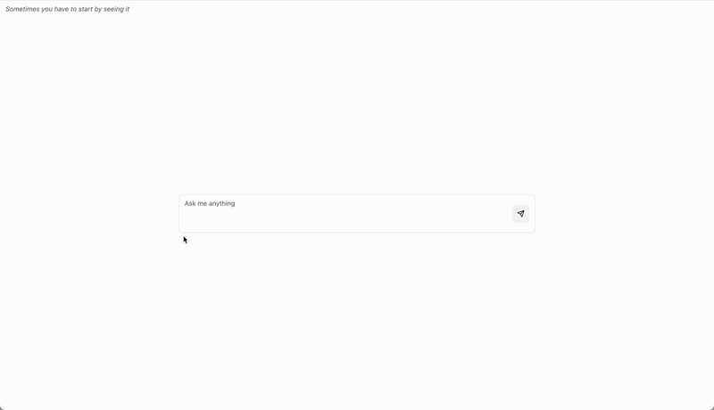

# A basic way to query an LLM

The **real goal** of this project is to practice FE and BE setup: typescript + React + Vite + tailwindCSS + lucide + shadCN for the FE, python + fastapi + uvicorn for the BE.

## So what

I want to become *fast* at prototyping things, so making simple FE & BE projects is a good skill to get comfortable with early on.

This projects unlocks me to practice cloud deployment, connection to a DNS, CI/CD, Docker, nginx, and other parts of software dev that are **NOT** writing code.

## Initial design

<!-- markdownlint-disable MD033 -->
<p align="center">
    
</p>
<!-- markdownlint-enable MD033 -->

## Final result

<!-- markdownlint-disable MD033 -->
<p align="center">
    
</p>
<!-- markdownlint-enable MD033 -->

## Project setup

### Clone the repo

``` bash
git clone https://github.com/mdahewlett/aiqa-first.git
```

### Run the frontend

``` bash
cd aiqa-first/frontend

npm i

npm run dev
```

### Run the backend

``` bash
cd aiqa-first/backend

python -m venv venv
source venv/bin/activate
pip install -r requirements.txt

uvicorn main:app --reload
```
