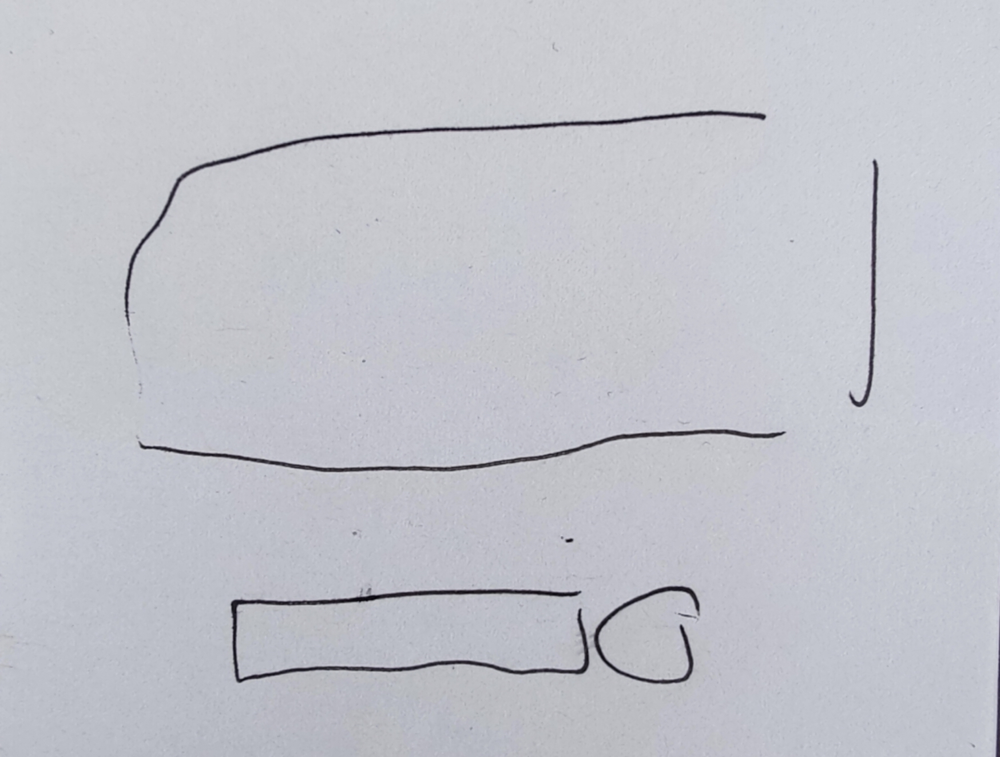

# What this project is  

This is my attempt at a simple frontend and backend setup for sending a query to an LLM and displaying the response to the user.

The goal is to practice project setup on the FE (typescript + React + Vite + tailwindCSS + lucide + shadCN) and the BE (TBD).

## Initial design

A basic way to query a LLM seems like a good enough place to start. This is my initial sketch of the FE: 

## How to run

Clone the repo

``` bash
git clone https://github.com/mdahewlett/aiqa-first.git
```

### Frontend

``` bash
cd aiqa-first/frontend
npm i
npm run dev
```
